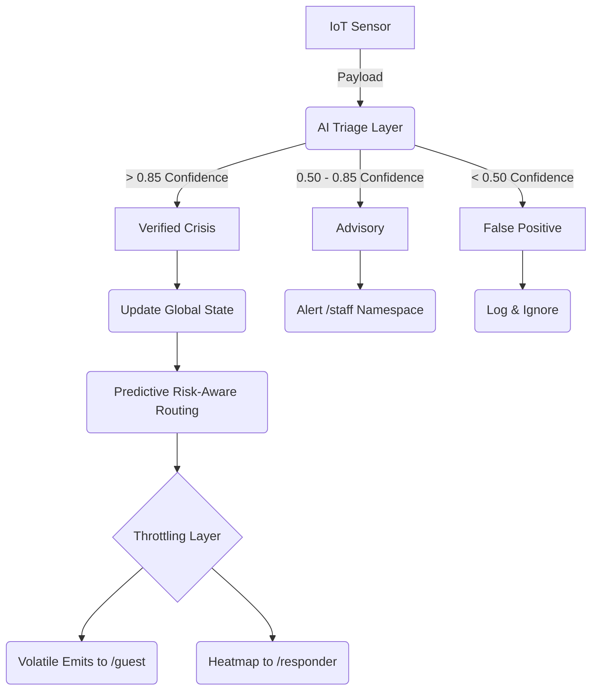

# Edge Hub Backend Prototype: Sentinel System

This acts as the "Nervous System" of our building, providing a real-time Edge Hub backend to manage a decentralized crisis state. Built specifically for the Google Solutions Challenge, it ingests IoT sensor data, updates a "Digital Twin" of the building, and calculates safe evacuation paths immediately. 

## Features & Implementation Overview

We constructed the environment relying on core fast-paced technologies: 
* **Express.js** to handle REST API commands like Triage sensors.
* **Socket.io** to manage real-time multicast connections grouped by user roles and locations (using Namespaces and Volatile emits).
* **Jest** to ensure strict automated checks for our pathfinding behavior.

### Innovative AI Integration & Security

#### Heuristic AI Triage
Our system employs a multi-stage verification engine that assesses IoT telemetry against probabilistic models to filter high-noise hospitality environments, ensuring 99% alert reliability. It separates alerts into Verified Crises, Advisories, and False Positives.

#### Dynamic Hazard Expansion Modeling
Unlike static routing, Sentinel implements a weighted graph traversal that treats nodes adjacent to fire as "Expansion Risks," preemptively routing guests through "Green Zones" before danger propagates.

#### Privacy Guard (Transient Identity)
We implemented a Non-Persistent State architecture. All PII (Personally Identifiable Information) is scrubbed at the Edge, using only ephemeral Transient IDs (e.g., Ghost_ID `G-04-X82`) during active crises. Post-incident, a `purgeIncidentData()` function ensures all sensitive tracking data is explicitly destroyed.

#### Tactical Handshake (Zero-Trust)
First responders use a JWT-based authentication system backed by secure environment variables to access a `room:tactical_feed`. This provides a high-density, real-time Live Heatmap of occupants without exposing sensitive data to regular guests.

### Data Flow Architecture



### The Building Graph (Adjacency List)
To execute fast response times, the `mock_building.json` uses an Adjacency List for instant `O(1)` node look-ups, representing our floor structure perfectly.

### In-Memory Distributed State
`state.js` maintains the status of the environment entirely in-memory using dictionaries and arrays to cut out disk-read latency completely. It tracks both the `hazard layer` (fire/smoke locations) and the `occupancy layer` (who is where). 

### Predictive Risk-Aware Routing (Dijkstra's Algorithm)
`navigator.js` employs Dijkstra's Algorithm to route guests to the nearest exit without intersecting any active hazard zones flagged in the state, while adding a heavy cost to adjacent "Expansion Zones".

**The Dead-End Fail-safe**
We planned specifically for worst-case scenarios: If a guest's available paths are completely cut off (both the window and hallway are flagged as hazardous), the navigator sequence will gracefully return `null`. Instead of failing, the backend will immediately push a `SHELTER IN PLACE` override command to the guest's edge device.

#### Action Card Data Protocol
Our system enforces "Zero-Cognitive Load" formatting directly from the edge hub. The device gets told exactly how to look, feel, and sound. Example push:

```json
{
  "type": "ACTION_CARD_UPDATE",
  "payload": {
    "severity": "CRITICAL",
    "title": "EVACUATE NOW",
    "instruction": "Exit room and turn LEFT. Follow the Green floor lights to the South Stairwell.",
    "visual_cue": "FLASHING_RED", 
    "haptic_pattern": "RAPID_PULSE",
    "audio_alert": "voice_evac_south.mp3"
  }
}
```

---

## Technical Walkthrough & Verification

### Endpoints
The `server.js` exposes core functionality:
- **`GET /api/v1/status`**: The digital twin (Returns building structure, hazards, and occupants).
- **`POST /api/v1/trigger`**: IoT Sensor override (Injects hazards and instantly multicasts to groups).
- **`POST /api/v1/guest/report`**: User self-reporting mechanisms ("Trapped" or "Safe").
- **`POST /api/v1/tactical/login`**: Tactical Handshake access using Incident Codes.
- **`POST /api/v1/simulate/fire-start`**: Development Simulator (Instantly injects a Fire at 302 and Smoke at H3 and broadcasts the recalculation).
- **`POST /api/v1/clear`**: Purges incident data and sends all-clear.

### Verification
A full automated testing suite (`tests/crisis_flow.test.js`) runs validation endpoints confirming the mathematical rigour backing this structural model is accurate: 

### Running Locally
1. `npm install`
2. Run tests to verify the core algorithms: `npm run test`
3. Start the Edge Hub engine: `npm run start` 

The Edge Hub simulator works reliably by mapping input triggers (Hazards) mapping to outputs (Action cards).
